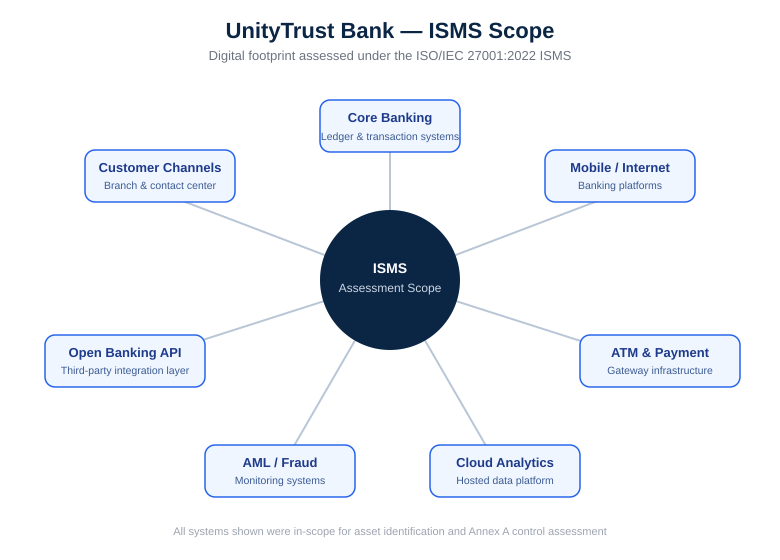
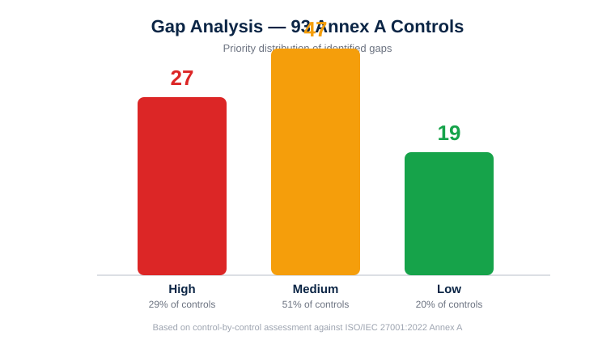
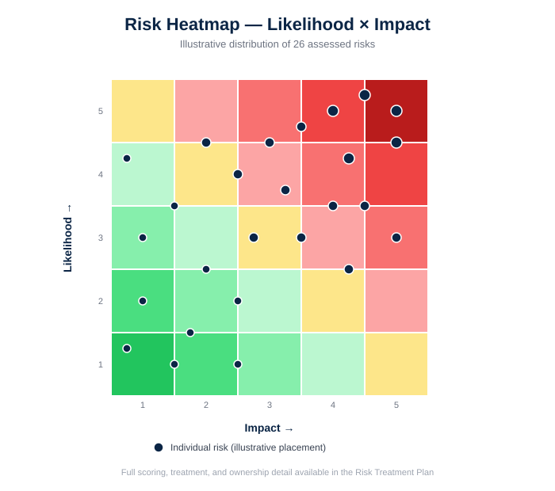

# 🏦 ISO/IEC 27001:2022 ISMS Implementation
### UnityTrust Bank — A Complete GRC Case Study

*End-to-end Information Security Management System assessment for a fictional digital-first commercial bank*

---

## 📋 Table of Contents

- [Overview](#overview)
- [Case Study Organization](#case-study-organization)
- [Methodology](#methodology)
- [Repository Contents](#repository-contents)
- [Key Findings](#key-findings)
- [Risk & Control Summary](#risk--control-summary)
- [Skills Demonstrated](#skills-demonstrated)
- [How to Use This Repository](#how-to-use-this-repository)
- [Disclaimer](#disclaimer)
- [Author](#author)

---

## 🔍 Overview

This repository documents a **complete ISO/IEC 27001:2022 Information Security Management System (ISMS) implementation cycle** — from initial asset identification through to a certification-ready Statement of Applicability. It was completed as the **capstone project** for a GRC (Governance, Risk & Compliance) internship at **PKCERT (National CERT of Pakistan)**.

The project simulates a real-world ISMS assessment engagement: identifying critical assets and their threats, benchmarking control maturity against all 93 ISO 27001 Annex A controls, building a prioritized risk treatment plan, and formally declaring control applicability — mirroring the exact deliverables an organization would produce on its path to ISO 27001 certification.

## 🏢 Case Study Organization

> **UnityTrust Bank** — a digital-first commercial bank

UnityTrust Bank operates a modern, technology-heavy banking stack, including:

- 🏛️ Core banking systems
- 📱 Mobile & internet banking platforms
- 🏧 ATM and payment gateway infrastructure
- 🔍 AML / fraud monitoring systems
- 🔗 Open banking API layer
- ☁️ Cloud-hosted analytics platform

This breadth of digital touchpoints makes UnityTrust Bank a realistic candidate for a full-scope ISMS assessment, covering everything from customer-facing channels to backend regulatory systems.

## 🧭 Methodology

The assessment followed a structured, four-phase GRC methodology:

| Phase | Activity | Output |
|---|---|---|
| **1. Asset Identification** | Catalogue critical assets; rate each by Confidentiality, Integrity, and Availability (CIA) impact; identify threats and vulnerabilities per asset | Asset & Threat Register |
| **2. Gap Analysis** | Assess current security practices against all **93 ISO/IEC 27001:2022 Annex A controls**; identify specific, prioritized gaps | Control-by-control Gap Analysis |
| **3. Risk Treatment Plan** | Convert each identified risk into a **Likelihood × Impact** score; define a **Mitigate** treatment with a specific control, an owner, and a target completion date | Risk Register & Treatment Plan |
| **4. Statement of Applicability (SoA)** | Formally declare which Annex A controls apply, the justification, and current implementation status | Statement of Applicability |

This phased approach mirrors the standard GRC lifecycle used by practitioners preparing an organization for ISO 27001 certification audits.

## 📂 Repository Contents

| File | Description |
|---|---|
| [`UnityTrust_Bank_Asset_Threat_Register.xlsx`](https://github.com/shehzad-GRC/GRC-Unity-Trust-Bank-/blob/590535de1360c0ffb37f6d83de39d91bf5ff180e/UnityTrust_Bank_Asset_Threat_Register.xlsx) | 26 identified assets, rated by CIA score and estimated financial impact (PKR), each mapped to specific threats and vulnerabilities. |
| [`UnityTrust_Bank_Gap_Analysis.docx`](https://github.com/shehzad-GRC/GRC-Unity-Trust-Bank-/blob/771c527a5bc241a09f341f0dc2cda95a04712533/UnityTrust_Bank_Gap_Analysis.docx) | Full control-by-control gap analysis across all 93 ISO/IEC 27001:2022 Annex A controls, with current state, gap, and priority. |
| [`UnityTrust_Bank_Risk_Treatment_Plan.xlsx`](https://github.com/shehzad-GRC/GRC-Unity-Trust-Bank-/blob/668c72e109c1ff33978fbb4b6e6005f3ea0334e3/UnityTrust_Bank_Risk_Treatment_Plan.xlsx) | Risk register with Likelihood × Impact scoring, Mitigate treatment, mapped Annex A control, control owner, timeline, and residual risk. |
| [`UnityTrust_Bank_Statement_of_Applicability.docx`](https://github.com/shehzad-GRC/GRC-Unity-Trust-Bank-/blob/3fadff2b2449fea6dbb213d7d7b8ff42641fec10/UnityTrust_Bank_Statement_of_Applicability.docx) | Formal declaration of applicability, justification, and implementation status for all 93 Annex A controls. |
| [`UnityTrust_Bank_Consolidated_Project_Report.docx`](https://github.com/shehzad-GRC/GRC-Unity-Trust-Bank-/blob/3fadff2b2449fea6dbb213d7d7b8ff42641fec10/UnityTrust_Bank_Consolidated_Project_Report.docx) | Executive-level report summarizing findings across all four deliverables. |

## 📊 Key Findings

<table>
<tr>
<td width="50%">

**Gap Analysis Results**
- 93 Annex A controls assessed
- 🔴 27 High priority gaps
- 🟠 47 Medium priority gaps
- 🟢 19 Low priority gaps

</td>
<td width="50%">

**Asset Risk Profile**
- 26 critical assets identified
- 🔴 5 rated Critical
- 🟠 12 rated High priority

</td>
</tr>
<tr>
<td width="50%">

**Risk Treatment**
- 26 risks assessed and treated
- ✅ 100% assigned a Mitigate treatment
- ✅ 100% have a named owner and timeline

</td>
<td width="50%">

**Statement of Applicability**
- 93 of 93 controls deemed applicable
- 🟡 92 controls partially implemented
- 🔴 1 control not yet implemented

</td>
</tr>
</table>

## 🎯 Risk & Control Summary

The assessment scope covers all three Annex A control themes defined in ISO/IEC 27001:2022:

- **Organizational controls** — policies, roles, supplier relationships, incident management
- **People controls** — screening, awareness, disciplinary process, remote working
- **Physical controls** — secure areas, equipment, media handling
- **Technological controls** — access control, cryptography, logging, network security, secure development

Each control was evaluated for **current implementation state**, **identified gap**, **priority**, and — where applicable — mapped to a specific risk in the treatment plan with a defined **owner** and **target completion date**.

## 🛠️ Skills Demonstrated

`ISO/IEC 27001:2022` · `Risk Assessment & Treatment` · `Gap Analysis` · `Asset Management` · `GRC Documentation` · `Information Security Governance` · `Statement of Applicability (SoA)` · `Control Mapping` · `Stakeholder Reporting`

## 📖 How to Use This Repository

1. Start with the **Consolidated Project Report** for an executive-level summary of the full engagement.
2. Review the **Asset & Threat Register** to understand the scope of assets assessed and their associated risks.
3. Dive into the **Gap Analysis** for a detailed, control-by-control breakdown against Annex A.
4. Check the **Risk Treatment Plan** to see how each risk was scored, treated, and assigned ownership.
5. Reference the **Statement of Applicability** for the formal certification-readiness declaration.

## ⚠️ Disclaimer

**UnityTrust Bank is a fictional organization** created solely for the purposes of this case study. All figures, systems, findings, and risk scores are illustrative and do not represent any real institution, its data, or its security posture.

## 👤 Author

**Shehzad Ahmad**
GRC Intern, PKCERT (National CERT of Pakistan)

---

Built as a capstone GRC project — demonstrating practical, end-to-end ISO/IEC 27001:2022 ISMS implementation skills.

